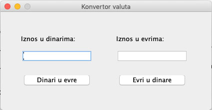

# Laboratorijske vežbe – dvočas br. 12

Za kreiranje GUI-ja namestiti opciju Window Builder-a na lazy code generation u Window > Preferences > WindowBuilder > Swing > Code Generation > Lazy

##Zadatak 1
*(radi laborant u saradnji sa studentima)*

Napraviti javnu klasu **Konvertor** u paketu **zadatak1.poslovna_logika** koja ima:

- Javnu metodu **konvertujDinareUEvre** koja kao ulazni argument dobija iznos u dinarima (realan broj). Ova metoda konvertuje ovaj iznos u evre i vraća ga (1EUR = 120DIN).

- Javnu metodu **konvertujEvreUDinare** koja kao ulazni argument dobija iznos u evrima (realan broj). Ova metoda konvertuje ovaj iznos u dinare i vraća ga (1EUR = 120DIN).

Napraviti klasu **KonvertorGUI** u paketu **zadatak1.gui** koja izgleda kao na slici. Podesiti da dimenzije prozora ne mogu da se menjaju. Klasa treba da:

- Ima privatni atribut **konvertor** tipa **Konvertor** .

- Na pritisak dugmeta **Dinari u evre** dinarski iznos koji je upisan u levo polje za unos konvertuje u evre i prikaže u desnom polju za unos. 

- Na pritisak dugmeta **Evri u dinare** iznos u evrima koji je upisan u desno polje za unos konvertuje u dinare i prikaže u levom polju za unos.

##Zadatak 2
*(studenti rade sami)*

Napisati javnu klasu **BMIKalkulator** u paketu **zadatak2.poslovna_logika** koja ima:

1. Javnu metodu **izracunajBMI** koja kao ulazni argument dobija visinu i težinu čoveka (realni brojevi). Visina je data u metrima a težina u kilogramima. Metoda izračunava i vraća BMI tj. Body Mass Index po formuli BMI = težina/visina2.

Napisati javnu klasu **BMIKalkulatorGUI** u paketu **zadatak2.gui** kojom se kreira korisnički interfejs prikazan na sledećoj slici. Podesiti da dimenzija prozora  ne može da se menja. Klasa treba da:
 
- Ima privatni atribut **bmiKalkulator** tipa **BMIKalkulator**.

- Nakon što korisnik unese podatke o visini i težini u odgovarajuća polja i klikne na dugme "Izracunaj BMI", u polju BMI se ispisuje izračunata vrednost BMI (Body Mass Index)-a. BMI izračunati koristeći metodu **izracunajBMI** klase **BMIKalkulator**.

